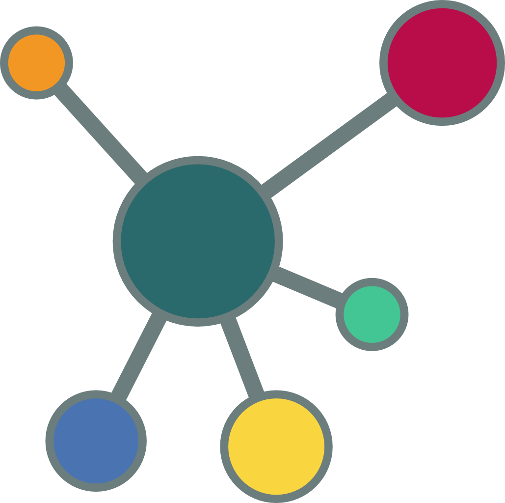
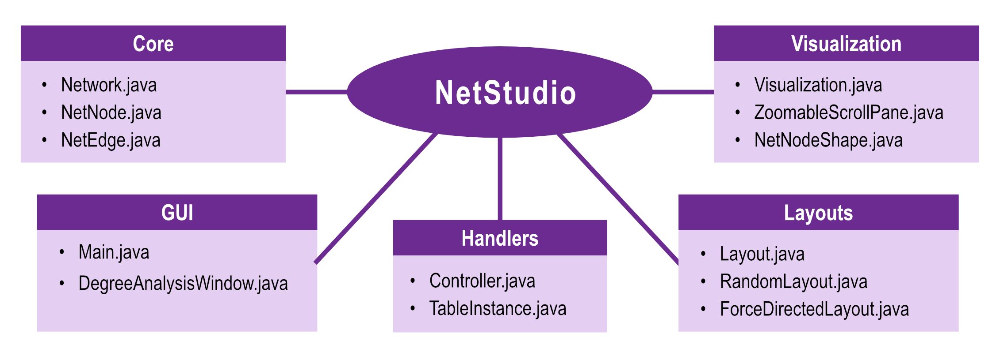
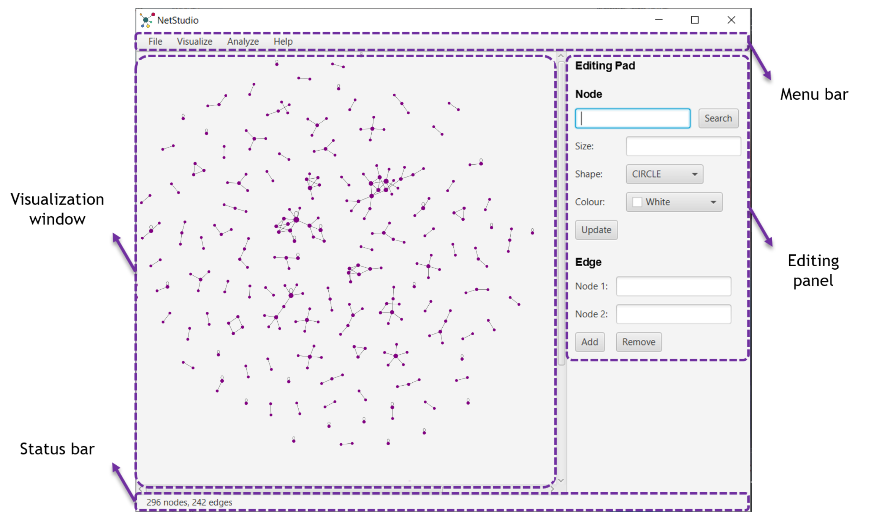
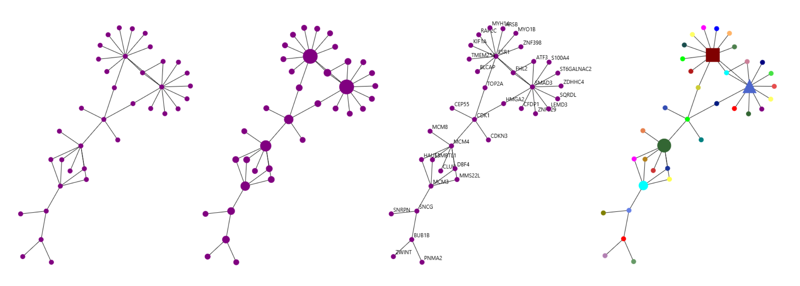
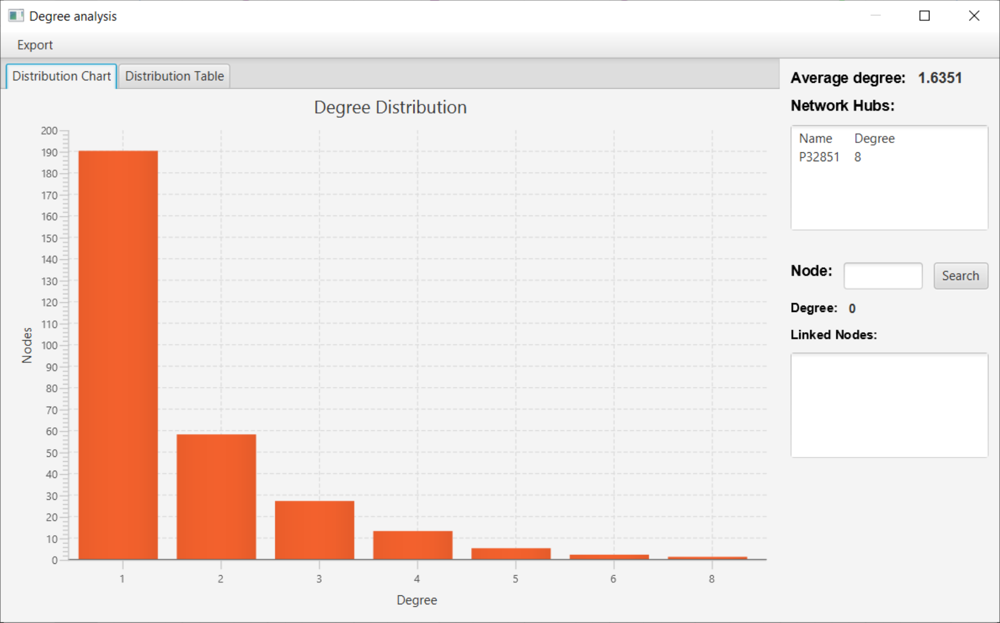

 <!---  -->

# NetStudio
> ***NetStudio*** is a simple Java desktop application for undirected graph visualization and analysis.
> The software was developed for fun and is provided as is for those learning and/or seeking for inspiration.
> Kindly drop a :star: if this is helpful!

|  |
|:--:|
| ***Architecture of the NetStudio application.*** |

## Usage

The application features a minimalist design to make its use as streamlined as possible.
It allows users to import networks and modify them by adding/removing edges or even to create 
new networks from scratch. Networks can be saved anytime to a new file directly from the main
window of the program. Node tagging, resizing, reshaping, customized colouring and several 
layout options are available. Analytical options are also included to visualize the distributional 
properties for the network degree with its average, the main hubs and node-specific interactions.

|  |
|:--:|
| ***Layout of the main window of the application.*** |

### File import/export

Network files can be loaded from the main window (**File > Load network**). Only tab-delimited node 
interaction files are allowed. Networks can also be exported from the program in the same format
(**File > Save network**).

### Network visualization

Networks are displayed in the view panel of the main window and newly added nodes are randomly 
located by default. Zooming options are actioned with mouse scrolling and node dragging is  
enabled. Images from the network view can be exported (**File > Export network image**).
Name tags for the nodes can be enabled/disabled anytime (**Visualize > Show node names**) and 
degree-based node resizing is also available (**Visualize > Size nodes by degree**).

Two display options are available:
- Random layout (**Visualize > Random layout**)
- Force directed layout (**Visualize > Force directed layout**).

|  |
|:--:|
| ***Visualization examples using NetStudio.*** |

### Network editing

The editing pad is located at the right side of the main window and allows to
interact with the network and its visualization. Visualization properties for existing
nodes can be checked and updated in the upper section (**Node**). The network can be 
modified with the bottom one (**Edge**) by adding/removing edges.

### Network analysis

A new window for degree analysis of the network can be opened from the menu bar 
(**Analyze > Degree analysis**). Here, the degree distribution can be visualized in
a bar plot and the distribution table can also be exported to a tab-delimited file. 
Other features include average degree calculation, hub node identification and 
obtaining node-specific interactions.

|  |
|:--:|
| ***Degree analysis window.*** |
